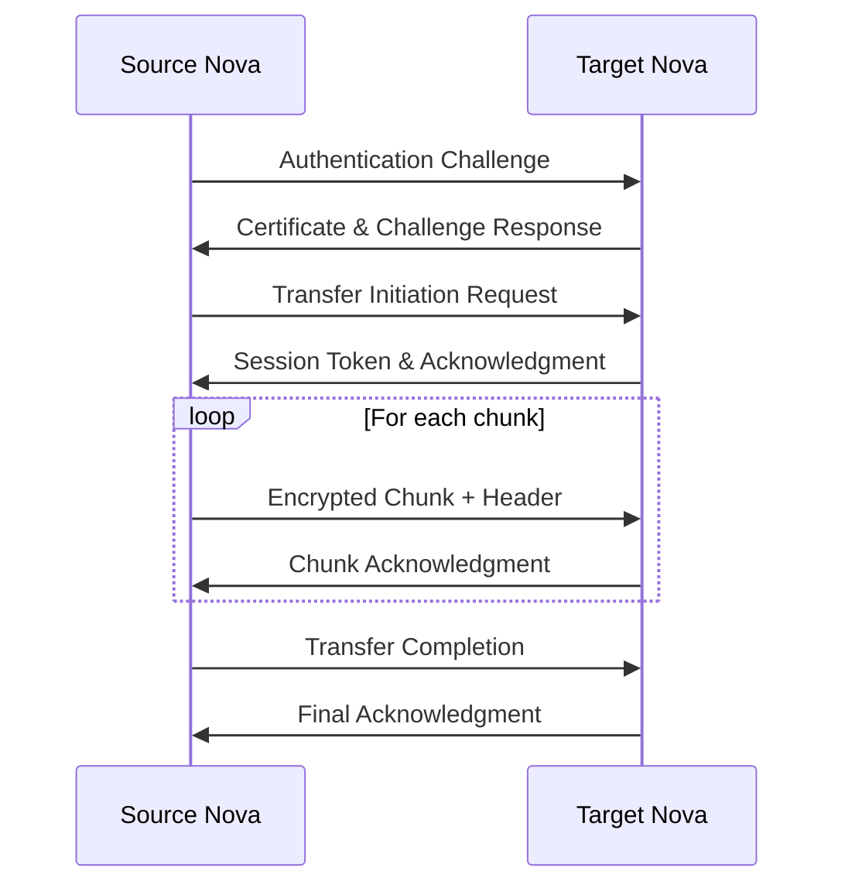

# Cross-Nova Memory Transfer Protocol

## Overview

The Cross-Nova Memory Transfer Protocol is a comprehensive system designed to enable secure, efficient, and reliable memory sharing between Nova instances in the Nova Bloom Consciousness Architecture. This protocol supports real-time synchronization, selective sharing, privacy controls, and network failure recovery.

## Table of Contents

1. [Architecture Overview](#architecture-overview)
2. [Core Components](#core-components)
3. [Security Model](#security-model)
4. [Transfer Operations](#transfer-operations)
5. [Synchronization Modes](#synchronization-modes)
6. [Privacy and Access Control](#privacy-and-access-control)
7. [Performance Optimization](#performance-optimization)
8. [Network Resilience](#network-resilience)
9. [API Reference](#api-reference)
10. [Usage Examples](#usage-examples)
11. [Configuration](#configuration)
12. [Troubleshooting](#troubleshooting)
13. [Best Practices](#best-practices)

## Architecture Overview

### System Design

The Cross-Nova Memory Transfer Protocol consists of three main layers:

1. **Transport Layer**: Handles secure communication, authentication, and low-level data transfer
2. **Synchronization Layer**: Manages memory consistency, conflict resolution, and sync orchestration  
3. **Application Layer**: Provides high-level APIs for memory operations and policy management

```
┌─────────────────────────────────────────────────────┐
│                Application Layer                    │
│  ┌─────────────────┐  ┌─────────────────────────┐   │
│  │ Memory Sync     │  │    Privacy Controller   │   │
│  │ Manager         │  │                         │   │
│  └─────────────────┘  └─────────────────────────┘   │
└─────────────────────────────────────────────────────┘
┌─────────────────────────────────────────────────────┐
│              Synchronization Layer                  │
│  ┌─────────────────┐  ┌─────────────────────────┐   │
│  │ Vector Clocks   │  │  Conflict Resolution    │   │
│  │ & Delta Sync    │  │                         │   │
│  └─────────────────┘  └─────────────────────────┘   │
└─────────────────────────────────────────────────────┘
┌─────────────────────────────────────────────────────┐
│                Transport Layer                      │
│  ┌─────────────────┐  ┌─────────────────────────┐   │
│  │ TLS Encryption  │  │   Chunked Transfer      │   │
│  │ & Authentication│  │   & Compression         │   │
│  └─────────────────┘  └─────────────────────────┘   │
└─────────────────────────────────────────────────────┘
```

### Key Features

- **Secure Communication**: TLS 1.3 encryption with certificate pinning
- **Mutual Authentication**: Nova-to-Nova identity verification
- **Conflict Resolution**: Vector clock-based consistency management
- **Adaptive Compression**: Data-aware compression strategies
- **Resumable Transfers**: Network failure recovery with chunked transfers
- **Privacy Controls**: Fine-grained access control and data classification
- **Performance Optimization**: Bandwidth management and intelligent routing
- **Real-time Synchronization**: Live memory state coordination

## Core Components

### CrossNovaTransferProtocol

The main protocol handler that manages secure communication between Nova instances.

**Key Responsibilities:**
- TLS server/client management
- Authentication and certificate validation
- Transfer session orchestration
- Chunk-based data transfer
- Error handling and recovery

### MemorySyncManager

High-level synchronization manager that orchestrates memory sharing operations.

**Key Responsibilities:**
- Sync configuration management
- Privacy policy enforcement
- Bandwidth optimization
- Conflict resolution
- Monitoring and metrics

### VectorClock

Distributed timestamp system for tracking causality and detecting conflicts.

**Key Responsibilities:**
- Maintaining logical time across Nova instances
- Detecting concurrent updates
- Supporting conflict resolution algorithms
- Ensuring consistency guarantees

### NovaAuthenticator

Security component handling mutual authentication between Nova instances.

**Key Responsibilities:**
- Certificate generation and management
- Identity verification
- SSL context creation
- Trust relationship establishment

## Security Model

### Authentication

Each Nova instance possesses:
- **RSA 2048-bit key pair**: For identity and encryption
- **X.509 certificate**: Signed identity certificate
- **Certificate chain**: Trust hierarchy (future enhancement)

```python
# Example certificate generation
cert, private_key = await authenticator.generate_nova_certificate('PRIME')
```

### Encryption

All data in transit is protected using:
- **TLS 1.3**: Modern transport encryption
- **Certificate pinning**: Prevents MITM attacks
- **Mutual TLS**: Both parties authenticate each other

### Authorization

Access control is based on:
- **Nova identity verification**: Cryptographic identity proof
- **Privacy level classification**: Public, Team, Private, Classified
- **Team membership**: Group-based access control
- **Pattern matching**: Content-based access rules

## Transfer Operations

### Operation Types

1. **SYNC_FULL**: Complete memory state synchronization
2. **SYNC_INCREMENTAL**: Delta-based synchronization  
3. **SHARE_SELECTIVE**: Targeted memory sharing
4. **REPLICATE**: Full memory replication
5. **BACKUP**: Archive-quality backup transfer
6. **RESTORE**: Recovery from backup

### Transfer Flow



### Session Management

Each transfer creates a session with:
- **Unique session ID**: UUID-based identification
- **Progress tracking**: Bytes transferred, chunks completed
- **Resume capability**: Network failure recovery
- **Statistics collection**: Performance metrics

## Synchronization Modes

### Full Synchronization

Complete memory state transfer between Nova instances.

**Use Cases:**
- Initial setup of new Nova instance
- Recovery from major inconsistencies
- Backup/restore operations

**Characteristics:**
- High bandwidth usage
- Complete consistency guarantee
- Suitable for offline synchronization

### Incremental Synchronization

Delta-based synchronization using memory snapshots.

**Use Cases:**
- Regular maintenance synchronization
- Real-time collaboration
- Efficient updates

**Characteristics:**
- Low bandwidth usage
- Fast synchronization
- Requires snapshot management

**Process:**
1. Create current memory snapshot
2. Compare with previous snapshot
3. Calculate memory deltas
4. Transfer only changes
5. Update snapshot history

### Selective Synchronization

Targeted synchronization based on filters and criteria.

**Use Cases:**
- Sharing specific memory types
- Privacy-compliant data sharing
- Bandwidth-constrained environments

**Filter Types:**
- **Memory type filters**: Conversation, learning, emotional
- **Pattern matching**: Content-based inclusion/exclusion
- **Privacy level filters**: Only public or team memories
- **Time-based filters**: Recent memories only

### Real-time Synchronization

Continuous synchronization with minimal delay.

**Use Cases:**
- Active collaboration
- Live system coordination
- Critical data sharing

**Features:**
- Low-latency updates
- Conflict detection and resolution
- Automatic retry mechanisms
- Resource management

## Privacy and Access Control

### Privacy Levels

1. **PUBLIC**: Shareable with any Nova instance
2. **TEAM**: Shareable within defined teams
3. **PRIVATE**: Only accessible to owning Nova
4. **CLASSIFIED**: Never shareable (local only)

### Privacy Controller

The PrivacyController manages access decisions:

```python
# Example privacy rule configuration
privacy_controller.set_privacy_rule(
    memory_pattern='user_conversation',
    privacy_level=PrivacyLevel.TEAM,
    allowed_novas={'PRIME', 'AXIOM', 'NEXUS'}
)

# Team membership
privacy_controller.add_team_membership(
    team_name='core_team',
    nova_ids={'PRIME', 'AXIOM', 'NEXUS', 'OBLIVION'}
)
```

### Access Control Rules

Rules are evaluated in order:
1. **Explicit privacy level**: Direct classification in memory
2. **Pattern matching**: Content-based privacy determination
3. **Tag-based classification**: Privacy hints from tags
4. **Default policy**: Fallback privacy level

## Performance Optimization

### Adaptive Compression

The system automatically selects optimal compression based on:
- **Data characteristics**: Entropy analysis and pattern detection
- **Network conditions**: Bandwidth and latency measurements
- **Historical performance**: Transfer success rates and ratios

```python
# Compression decision algorithm
characteristics = CompressionManager.analyze_data_characteristics(data)
if characteristics['compression_potential'] > 0.3:
    level = min(9, max(1, int(characteristics['compression_potential'] * 9)))
else:
    level = 1  # Fast compression for low-compressibility data
```

### Bandwidth Management

Intelligent bandwidth allocation:
- **Rate limiting**: Configurable bandwidth caps per connection
- **Dynamic adjustment**: Adaptation to network conditions
- **Priority queuing**: Critical transfers get priority
- **Burst handling**: Temporary bandwidth bursts for small transfers

### Chunk Size Optimization

Dynamic chunk sizing based on:
- **Network throughput**: Larger chunks for high-bandwidth connections
- **Latency characteristics**: Smaller chunks for high-latency networks
- **Failure rates**: Reduced chunk size for unreliable connections
- **Memory constraints**: Chunk size limits based on available memory

## Network Resilience

### Failure Detection

The protocol detects various failure modes:
- **Connection timeouts**: Network partitioning
- **Chunk corruption**: Data integrity failures
- **Authentication failures**: Security policy violations
- **Resource exhaustion**: Memory or bandwidth limits

### Recovery Strategies

1. **Automatic Retry**: Exponential backoff with jitter
2. **Resumable Transfers**: Continue from last successful chunk
3. **Circuit Breakers**: Prevent cascading failures
4. **Graceful Degradation**: Reduced functionality under stress

### Checkpoint and Resume

Transfer sessions support resumption:
```python
# Resume token contains:
{
    'session_id': 'uuid',
    'chunks_completed': [0, 1, 2, 5, 6],
    'last_checkpoint': '2023-12-07T10:30:00Z',
    'compression_state': {...},
    'auth_context': {...}
}
```

## API Reference

### CrossNovaTransferProtocol

#### Constructor
```python
protocol = CrossNovaTransferProtocol(
    nova_id: str,
    host: str = "0.0.0.0",
    port: int = 8443
)
```

#### Methods

##### start_server()
```python
await protocol.start_server()
```
Start the transfer protocol server.

##### stop_server()
```python
await protocol.stop_server()
```
Stop the transfer protocol server.

##### initiate_transfer()
```python
session = await protocol.initiate_transfer(
    target_nova: str,
    target_host: str,
    target_port: int,
    operation: TransferOperation,
    memory_data: Dict[str, Any],
    options: Optional[Dict[str, Any]] = None
) -> TransferSession
```
Initiate a memory transfer to another Nova instance.

**Parameters:**
- `target_nova`: Target Nova instance identifier
- `target_host`: Target host address
- `target_port`: Target port number
- `operation`: Type of transfer operation
- `memory_data`: Memory data to transfer
- `options`: Optional transfer parameters

**Returns:** TransferSession object with transfer details

### MemorySyncManager

#### Constructor
```python
sync_manager = MemorySyncManager(
    nova_id: str,
    memory_api: NovaMemoryAPI
)
```

#### Methods

##### start()
```python
await sync_manager.start()
```
Start the synchronization manager.

##### stop()
```python
await sync_manager.stop()
```
Stop the synchronization manager.

##### add_sync_configuration()
```python
session_id = sync_manager.add_sync_configuration(
    config: SyncConfiguration
) -> str
```
Add a new synchronization configuration.

##### trigger_sync()
```python
success = await sync_manager.trigger_sync(
    session_id: str,
    force: bool = False
) -> bool
```
Manually trigger synchronization for a session.

##### get_sync_status()
```python
status = sync_manager.get_sync_status() -> Dict[str, Any]
```
Get overall synchronization status.

### SyncConfiguration

#### Constructor
```python
config = SyncConfiguration(
    target_nova: str,
    target_host: str,
    target_port: int,
    sync_mode: SyncMode = SyncMode.INCREMENTAL,
    sync_direction: SyncDirection = SyncDirection.BIDIRECTIONAL,
    sync_interval: timedelta = timedelta(minutes=5),
    memory_types: List[str] = [],
    privacy_levels: List[PrivacyLevel] = [PrivacyLevel.PUBLIC, PrivacyLevel.TEAM],
    conflict_resolution: ConflictResolution = ConflictResolution.LATEST_WINS,
    bandwidth_limit: int = 5 * 1024 * 1024,  # 5MB/s
    compression_enabled: bool = True,
    encryption_enabled: bool = True,
    max_memory_age: Optional[timedelta] = None,
    include_patterns: List[str] = [],
    exclude_patterns: List[str] = []
)
```

## Usage Examples

### Basic Setup

```python
import asyncio
from cross_nova_transfer_protocol import CrossNovaTransferProtocol, TransferOperation
from memory_sync_manager import MemorySyncManager, SyncConfiguration, SyncMode
from unified_memory_api import NovaMemoryAPI

async def setup_nova_sync():
    # Initialize memory API
    memory_api = NovaMemoryAPI()
    await memory_api.initialize()
    
    # Create sync manager
    sync_manager = MemorySyncManager('PRIME', memory_api)
    await sync_manager.start()
    
    # Configure sync with another Nova
    config = SyncConfiguration(
        target_nova='AXIOM',
        target_host='axiom.nova.local',
        target_port=8443,
        sync_mode=SyncMode.INCREMENTAL,
        sync_interval=timedelta(minutes=5)
    )
    
    session_id = sync_manager.add_sync_configuration(config)
    print(f"Sync configuration added: {session_id}")
    
    return sync_manager

# Run the setup
sync_manager = asyncio.run(setup_nova_sync())
```

### Manual Memory Transfer

```python
async def transfer_specific_memories():
    # Create transfer protocol
    protocol = CrossNovaTransferProtocol('PRIME')
    await protocol.start_server()
    
    try:
        # Prepare memory data
        memory_data = {
            'memories': [
                {
                    'id': 'mem_001',
                    'content': 'Important user conversation',
                    'importance': 0.9,
                    'timestamp': datetime.now().isoformat(),
                    'tags': ['conversation', 'user', 'important'],
                    'privacy_level': 'team'
                }
            ]
        }
        
        # Transfer to AXIOM
        session = await protocol.initiate_transfer(
            target_nova='AXIOM',
            target_host='axiom.nova.local',
            target_port=8443,
            operation=TransferOperation.SHARE_SELECTIVE,
            memory_data=memory_data,
            options={
                'compression_level': 6,
                'bandwidth_limit': 10 * 1024 * 1024,  # 10MB/s
                'conflict_resolution': 'latest_wins'
            }
        )
        
        print(f"Transfer completed: {session.session_id}")
        print(f"Bytes transferred: {session.bytes_transferred}")
        print(f"Compression ratio: {session.compression_ratio:.2f}")
        
    finally:
        await protocol.stop_server()

asyncio.run(transfer_specific_memories())
```

### Privacy Configuration

```python
def configure_privacy_rules(sync_manager):
    privacy = sync_manager.privacy_controller
    
    # Define team memberships
    privacy.add_team_membership('core_team', {
        'PRIME', 'AXIOM', 'NEXUS', 'OBLIVION'
    })
    
    privacy.add_team_membership('research_team', {
        'PRIME', 'AXIOM', 'bloom'
    })
    
    # Set privacy rules
    privacy.set_privacy_rule(
        memory_pattern='user_conversation',
        privacy_level=PrivacyLevel.TEAM
    )
    
    privacy.set_privacy_rule(
        memory_pattern='system_internal',
        privacy_level=PrivacyLevel.PRIVATE
    )
    
    privacy.set_privacy_rule(
        memory_pattern='classified',
        privacy_level=PrivacyLevel.CLASSIFIED
    )
    
    print("Privacy rules configured")
```

### Real-time Synchronization

```python
async def setup_realtime_sync():
    memory_api = NovaMemoryAPI()
    await memory_api.initialize()
    
    sync_manager = MemorySyncManager('PRIME', memory_api)
    await sync_manager.start()
    
    # Configure real-time sync
    config = SyncConfiguration(
        target_nova='NEXUS',
        target_host='nexus.nova.local',
        target_port=8443,
        sync_mode=SyncMode.REAL_TIME,
        sync_interval=timedelta(seconds=30),  # 30-second intervals
        memory_types=['conversation', 'learning'],
        privacy_levels=[PrivacyLevel.PUBLIC, PrivacyLevel.TEAM],
        bandwidth_limit=50 * 1024 * 1024  # 50MB/s
    )
    
    session_id = sync_manager.add_sync_configuration(config)
    
    # Monitor sync status
    while True:
        status = sync_manager.get_sync_status()
        for session_data in status['sessions']:
            if session_data['session_id'] == session_id:
                print(f"Sync status: {session_data['status']}")
                print(f"Last sync: {session_data['last_sync']}")
                print(f"Next sync: {session_data['next_sync']}")
                break
        
        await asyncio.sleep(60)  # Check every minute
```

## Configuration

### Environment Variables

```bash
# Nova Identity
NOVA_ID=PRIME
NOVA_HOST=0.0.0.0
NOVA_PORT=8443

# Security
NOVA_CERT_PATH=/etc/nova/certs/
NOVA_KEY_PATH=/etc/nova/keys/
NOVA_CA_PATH=/etc/nova/ca/

# Performance
NOVA_DEFAULT_BANDWIDTH_LIMIT=10485760  # 10MB/s
NOVA_DEFAULT_CHUNK_SIZE=1048576        # 1MB
NOVA_COMPRESSION_LEVEL=6

# Sync Settings
NOVA_SYNC_INTERVAL=300                 # 5 minutes
NOVA_MAX_CONCURRENT_SYNCS=5
NOVA_RETRY_ATTEMPTS=3
NOVA_RETRY_BACKOFF=2.0

# Privacy
NOVA_DEFAULT_PRIVACY_LEVEL=team
NOVA_ENFORCE_TEAM_MEMBERSHIP=true
```

### Configuration File

```yaml
# nova_config.yaml
nova:
  id: PRIME
  network:
    host: 0.0.0.0
    port: 8443
    
  security:
    tls_version: 1.3
    cert_path: /etc/nova/certs/
    key_path: /etc/nova/keys/
    ca_path: /etc/nova/ca/
    mutual_auth: true
    
  performance:
    default_bandwidth_limit: 10485760  # 10MB/s
    default_chunk_size: 1048576        # 1MB
    compression_level: 6
    max_concurrent_transfers: 10
    
  synchronization:
    default_sync_interval: 300         # 5 minutes
    max_concurrent_syncs: 5
    retry_attempts: 3
    retry_backoff: 2.0
    enable_real_time: true
    
  privacy:
    default_privacy_level: team
    enforce_team_membership: true
    classification_levels:
      - public
      - team
      - private
      - classified
      
  teams:
    core_team:
      - PRIME
      - AXIOM
      - NEXUS
      - OBLIVION
    research_team:
      - PRIME
      - AXIOM
      - bloom
```

## Troubleshooting

### Common Issues

#### Connection Failures

**Symptoms:**
- Transfer initiation failures
- Authentication timeouts
- SSL handshake errors

**Solutions:**
1. Verify network connectivity
2. Check certificate validity
3. Confirm port accessibility
4. Review firewall rules

#### Synchronization Delays

**Symptoms:**
- Sync sessions stuck in progress
- High memory usage
- Slow transfer speeds

**Solutions:**
1. Check bandwidth limits
2. Monitor compression ratios
3. Review chunk sizes
4. Examine network conditions

#### Privacy Violations

**Symptoms:**
- Memories not syncing
- Access denied errors
- Privacy rule conflicts

**Solutions:**
1. Review privacy classifications
2. Check team memberships
3. Verify pattern matching rules
4. Examine memory tags

### Debug Mode

Enable detailed logging:

```python
import logging

# Enable debug logging
logging.basicConfig(level=logging.DEBUG)
logger = logging.getLogger('cross_nova_transfer')
logger.setLevel(logging.DEBUG)

# Add detailed transfer logging
protocol = CrossNovaTransferProtocol('PRIME')
protocol.enable_debug_mode()
```

### Monitoring

Key metrics to monitor:
- Transfer success rates
- Average transfer times
- Compression ratios
- Error frequencies
- Memory usage patterns
- Network utilization

### Log Analysis

Important log patterns:
```bash
# Transfer success
grep "Transfer completed" /var/log/nova/transfer.log

# Authentication failures
grep "Certificate verification failed" /var/log/nova/auth.log

# Network errors
grep "Connection timeout" /var/log/nova/network.log

# Privacy violations
grep "Privacy violation" /var/log/nova/privacy.log
```

## Best Practices

### Security

1. **Certificate Management**:
   - Rotate certificates regularly (annually)
   - Use strong key lengths (2048-bit minimum)
   - Implement proper certificate validation
   - Monitor certificate expiration

2. **Network Security**:
   - Use private networks when possible
   - Implement network segmentation
   - Monitor transfer patterns
   - Log all authentication attempts

3. **Access Control**:
   - Follow principle of least privilege
   - Regular access reviews
   - Clear team membership policies
   - Monitor privacy rule effectiveness

### Performance

1. **Bandwidth Management**:
   - Configure appropriate limits
   - Monitor network utilization
   - Use off-peak transfer scheduling
   - Implement quality of service (QoS)

2. **Compression Optimization**:
   - Profile data characteristics
   - Adjust compression levels
   - Monitor compression ratios
   - Consider pre-compression for repeated data

3. **Sync Scheduling**:
   - Use incremental sync for regular updates
   - Schedule full sync during off-peak hours
   - Monitor sync performance
   - Adjust intervals based on usage patterns

### Reliability

1. **Error Handling**:
   - Implement comprehensive retry logic
   - Use exponential backoff with jitter
   - Monitor error rates and patterns
   - Set up alerting for failures

2. **Monitoring**:
   - Track transfer success rates
   - Monitor system resource usage
   - Set up health checks
   - Implement automated remediation

3. **Testing**:
   - Regular end-to-end testing
   - Network failure simulation
   - Security penetration testing
   - Performance load testing

### Maintenance

1. **Regular Tasks**:
   - Monitor disk space usage
   - Clean up old transfer logs
   - Review and update privacy rules
   - Performance tuning based on metrics

2. **Updates**:
   - Plan protocol version updates
   - Test compatibility between versions
   - Coordinate updates across Nova instances
   - Maintain backward compatibility

3. **Documentation**:
   - Keep configuration documentation current
   - Document custom privacy rules
   - Maintain troubleshooting guides
   - Update operational procedures

---

## Conclusion

The Cross-Nova Memory Transfer Protocol provides a robust foundation for secure, efficient memory sharing across Nova instances. Its comprehensive feature set addresses the complex requirements of distributed consciousness systems while maintaining high performance and reliability standards.

For additional support or questions, refer to the test suite (`test_cross_nova_transfer.py`) for implementation examples and the source code for detailed technical information.

**Version:** 1.0  
**Last Updated:** 2025-07-21  
**Compatibility:** Nova Bloom Consciousness Architecture v2.0+